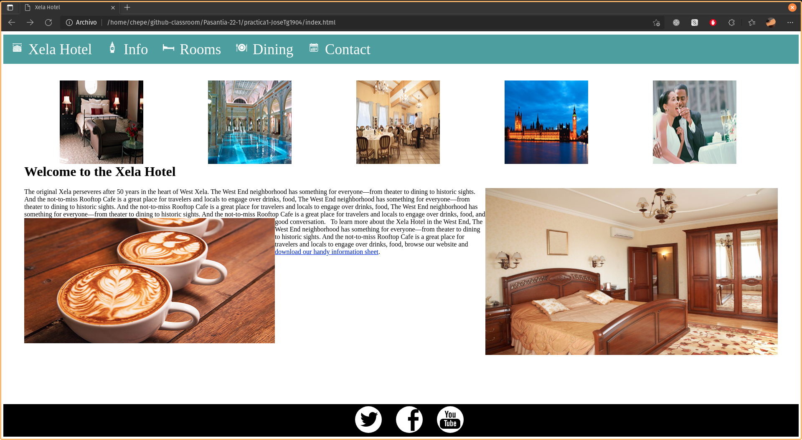
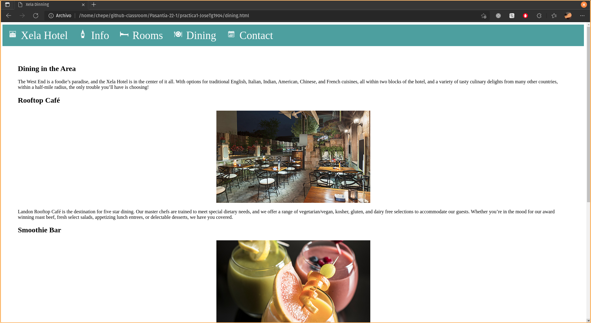
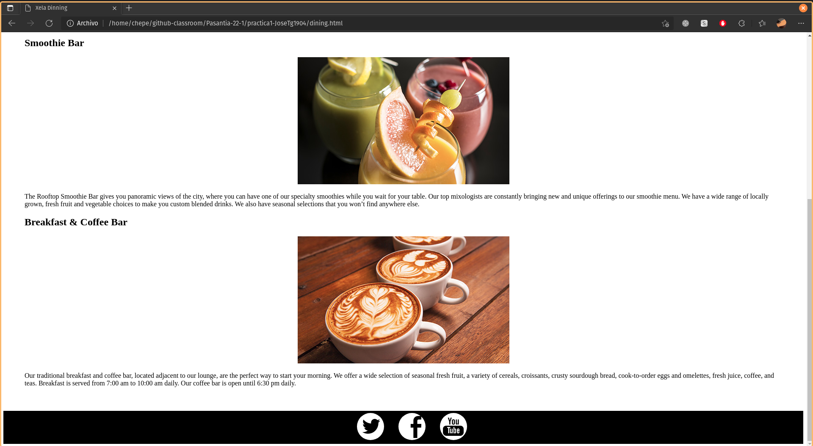
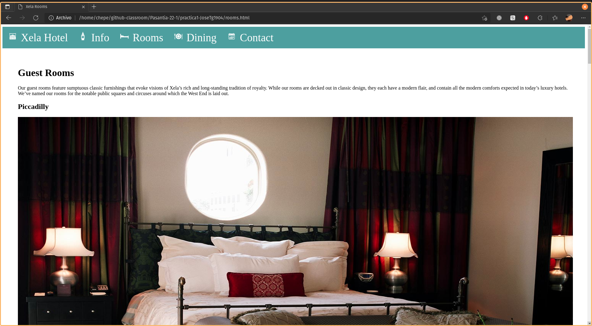
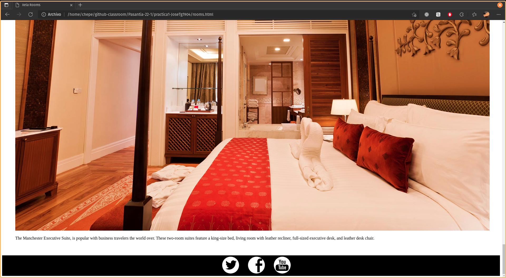

# Vistas

## Index

 

## Dinners

 

## Rooms

   

# Dificultades

Utilizar codigo html y css puro, estoy acostumbrado a utilizar librerias como bootstrap o material-ui para Angular en la que no me tengo que preocupar por muchos de los aspectos basicos del maquetado